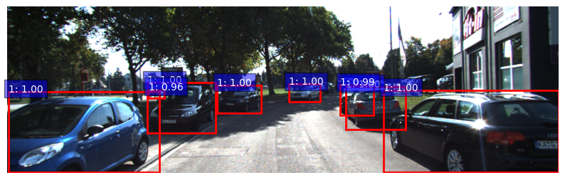
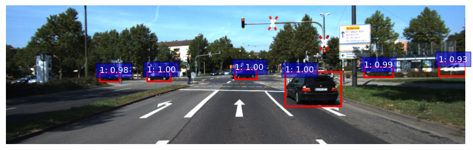
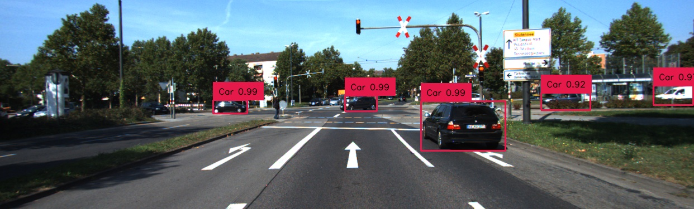
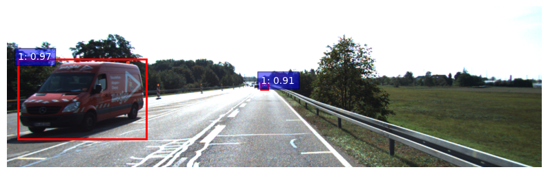

# Faster R-CNN vs. DETR: A Practical Lightweight Benchmark for Real-World Car Detection on KITTI
Car detection project comparing Faster R-CNN and DETR on the KITTI dataset.

## Dataset
- **[KITTI Dataset](https://www.cvlibs.net/datasets/kitti/)**
- Contains images and bounding boxes for cars.

## Model Comparison
| Model        | AP@0.5 | AP@0.75 | Notes                  |
|--------------|--------|---------|------------------------|
| Faster R-CNN | 0.88   | 0.69    | Good on small objects  |
| DETR         | 0.83   | 0.62    | Promising results      |

**Read the full article [here](https://medium.com/@monishatemp20/faster-r-cnn-vs-detr-a-practical-lightweight-benchmark-for-real-world-car-detection-on-kitti-983c714e2da3)**

## Sample Predictions

### Faster R-CNN

### DETR

### Faster R-CNN (False positive)

 **Try it in Colab**:
- [Faster R-CNN Notebook](notebooks/Faster_R_CNN_on_Kitti.py)
- [DETR Notebook](notebooks/detr_on_kitti.py)

